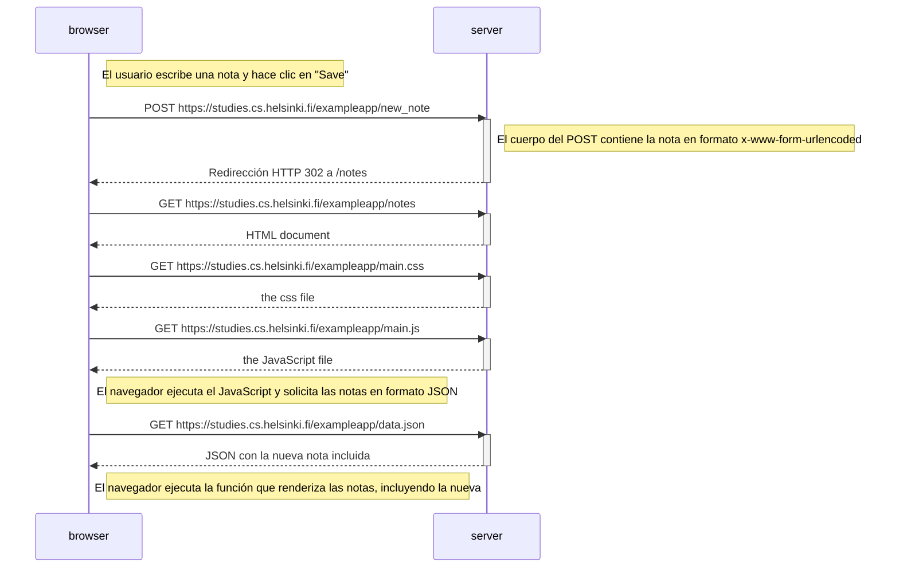

# Diagrama de secuencia: Crear una nueva nota

```mermaid
sequenceDiagram
    participant browser
    participant server

    Note right of browser: El usuario escribe una nota y hace clic en "Save"

    browser->>server: POST https://studies.cs.helsinki.fi/exampleapp/new_note
    activate server
    Note right of server: El cuerpo del POST contiene la nota en formato x-www-form-urlencoded
    server-->>browser: Redirección HTTP 302 a /notes
    deactivate server

    browser->>server: GET https://studies.cs.helsinki.fi/exampleapp/notes
    activate server
    server-->>browser: HTML document
    deactivate server

    browser->>server: GET https://studies.cs.helsinki.fi/exampleapp/main.css
    activate server
    server-->>browser: the css file
    deactivate server

    browser->>server: GET https://studies.cs.helsinki.fi/exampleapp/main.js
    activate server
    server-->>browser: the JavaScript file
    deactivate server

    Note right of browser: El navegador ejecuta el JavaScript y solicita las notas en formato JSON

    browser->>server: GET https://studies.cs.helsinki.fi/exampleapp/data.json
    activate server
    server-->>browser: JSON con la nueva nota incluida
    deactivate server

    Note right of browser: El navegador ejecuta la función que renderiza las notas, incluyendo la nueva
```
