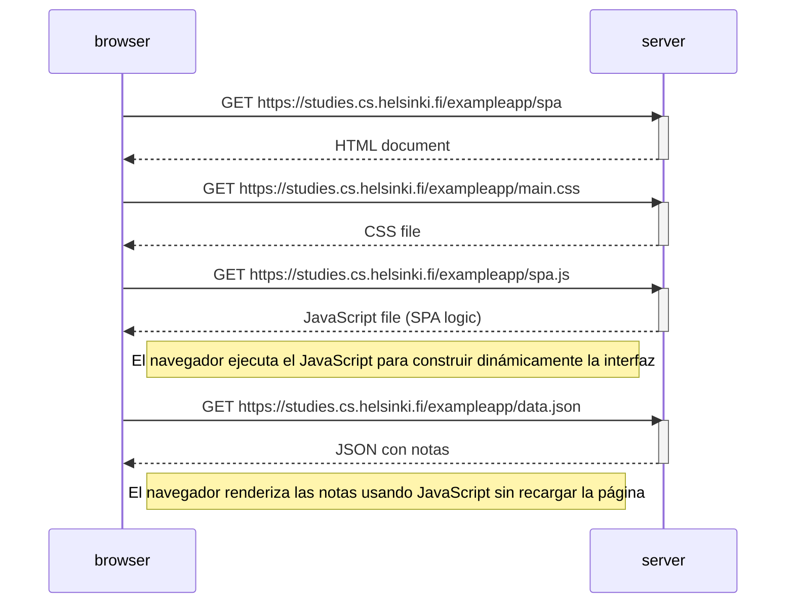

# Diagrama de secuencia: Acceso a la versión SPA de la aplicación de notas

```mermaid
sequenceDiagram
    participant browser
    participant server

    browser->>server: GET https://studies.cs.helsinki.fi/exampleapp/spa
    activate server
    server-->>browser: HTML document
    deactivate server

    browser->>server: GET https://studies.cs.helsinki.fi/exampleapp/main.css
    activate server
    server-->>browser: CSS file
    deactivate server

    browser->>server: GET https://studies.cs.helsinki.fi/exampleapp/spa.js
    activate server
    server-->>browser: JavaScript file (SPA logic)
    deactivate server

    Note right of browser: El navegador ejecuta el JavaScript para construir dinámicamente la interfaz

    browser->>server: GET https://studies.cs.helsinki.fi/exampleapp/data.json
    activate server
    server-->>browser: JSON con notas
    deactivate server

    Note right of browser: El navegador renderiza las notas usando JavaScript sin recargar la página
```
